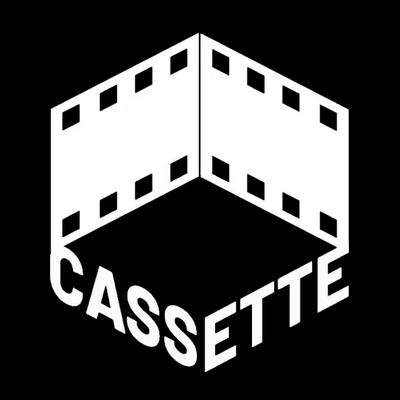

<p align="center">
  
</p>

<h1 align="center">Oh My Cassette</h1>

<p align="center">
  Video editing through the <a href="https://trycassette.online">Cassette</a> agent, from Claude Code, Codex, OpenCode and Hermes.<br />
  <sub>A small MCP bridge on PyPI. The editing tools come from the Cassette MCP service, so they stay current without a plugin update.</sub>
</p>

<p align="center">
  <a href="https://pypi.org/project/oh-my-cassette/"></a>
  <a href="./LICENSE"></a>
  <a href="./README.zh-cn.md">中文</a>
</p>

---

## Install in 30 seconds

You need [uv](https://docs.astral.sh/uv/) (it fetches Python and the package on first start).

```bash
# Claude Code
claude plugin marketplace add Cassette-Editor/oh-my-cassette
claude plugin install oh-my-cassette@cassette-editor
```

```bash
# Codex
codex plugin marketplace add https://github.com/Cassette-Editor/oh-my-cassette.git
codex plugin add oh-my-cassette@cassette-editor
```

```bash
# Hermes
hermes mcp add cassette --command uvx --args oh-my-cassette==0.5.0
```

OpenCode and any other MCP host: see [Install](#install) below. Run `uvx oh-my-cassette==0.5.0 login` and complete the email-code sign-in in your browser. Then restart your agent if it cannot refresh its tool list, and say:

> *Import ./footage/*.mp4 and cut a 30-second travel vlog with a title at the start.*

## Overview

Oh My Cassette connects your coding agent to the Cassette editing agent. It is a local stdio MCP server
that relays to the Cassette MCP service (`CASSETTE_MCP_URL`), which in turn calls the Cassette backend:

```text
Claude Code / Codex / OpenCode / Hermes  ──stdio──▶  oh-my-cassette  ──HTTP──▶  Cassette MCP service  ──▶  Cassette backend
```

- **The tools are the service's.** Whatever it lists (projects, editing turns, questions, undo,
  export) is what your agent sees, with the service's own descriptions and workflow instructions.
  When Cassette changes, the tools change with it; the plugin does not need a release.
- **The bridge adds only what needs your machine.** Local files named in a call are prepared and
  uploaded first (only from the workspace, media types only): video is transcoded with ffmpeg into the
  renditions the service declares, and audio or images it does not take as they are get converted.
  Exported files are downloaded into `cassette-exports/`. The workspace identity travels with each
  call so the service can remember a project per directory.
- **Long work never times out the host.** Every call waits a bounded time; slow local preparation
  answers `preparing` and keeps going in the background, and the next identical call picks it up.
- **It survives deploys.** It reconnects on its own, reports `bridge.*` errors with a `retryable`
  flag, and, while the service is unreachable or refuses the token, lists a single
  `cassette_bridge_status` tool that says why.

The rules between the plugin and the service are written down in [docs/v3/contract.md](./docs/v3/contract.md)
(in Chinese); `oh-my-cassette check` verifies a service against them.

### Case videos

Six real cases edited end to end through Oh My Cassette, each with the exact prompt, inputs and processing time: [docs/showcase.md](./docs/showcase.md).

## Requirements

- An invited Cassette account and a Cassette MCP service that implements [contract v1](./docs/v3/contract.md). Check it with `uvx oh-my-cassette==0.5.0 check --url <endpoint>`. While the
  service is unreachable or refuses the token, only `cassette_bridge_status` is listed.
- [uv](https://docs.astral.sh/uv/getting-started/installation/) 0.5 or newer. `uvx oh-my-cassette==0.5.0` resolves Python 3.11–3.13 by itself.
- [ffmpeg](https://ffmpeg.org/download.html) (with ffprobe) to import video: `brew install ffmpeg`,
  `sudo apt install ffmpeg` or `winget install ffmpeg`. Video is transcoded on your machine before it
  uploads. A build with `zscale` also tone-maps HDR footage properly.

Which formats a tool accepts, and how files are prepared before upload, is declared by the service
(video, audio and image types at most).

## Configuration

Sign in once with `oh-my-cassette login --target web`. To connect to the open Desktop account, use `--target desktop` explicitly. [Login, status and logout](./docs/oauth.md) use your operating-system keyring; no token needs to be copied. Environment variables below are optional overrides.

| Variable | Default | Meaning |
| --- | --- | --- |
| `CASSETTE_MCP_URL` | saved target, otherwise Cassette Web | Explicit MCP endpoint override. |
| `CASSETTE_AUTH_TOKEN` | unset | Advanced bearer-token override. Normally use `login`; the same account, scope and resource checks apply. Never place it in shared configuration. |
| `CASSETTE_WORKSPACE` | the directory the host starts the server in | Where relative paths resolve, and the directory the service may remember a project for. |
| `CASSETTE_ALLOWED_ROOTS` | unset | Extra directories local files may come from (`:`-separated; `;` on Windows). |
| `CASSETTE_DOWNLOAD_DIR` | `<workspace>/cassette-exports` | Where exported files are saved. |
| `CASSETTE_MAX_UPLOAD_MB` / `CASSETTE_MAX_DOWNLOAD_MB` | `4096` / `16384` | Size limits per file. |
| `CASSETTE_UPLOAD_ANY_TYPE` | off | Allow non-media uploads when a tool accepts them. |
| `CASSETTE_LOCAL_WAIT_SEC` | `240` | How long one call waits for local preparation and upload before it answers `preparing`. |
| `CASSETTE_FFMPEG` / `CASSETTE_FFPROBE` | from `PATH` | The ffmpeg and ffprobe programs used to prepare local media. |
| `CASSETTE_TEMP_DIR` | `<system temp>/oh-my-cassette` | Where prepared files are written until they are uploaded. |
| `CASSETTE_CONNECT_TIMEOUT_SEC` | `10` | How long to wait for the service when connecting. |
| `OH_MY_CASSETTE_LOG` | `WARNING` | Log level on stderr. |

## Install

### Claude Code

Plugin (recommended): the two commands at the top. The plugin uses the connection saved by `oh-my-cassette login` and starts `uvx oh-my-cassette==0.5.0` with a 10-minute tool timeout.

Project scope without the plugin: copy [`.mcp.json`](./.mcp.json) into your project, or run:

```bash
claude mcp add --transport stdio cassette -- uvx oh-my-cassette==0.5.0
```

The skill lives in [`skills/cassette-video-edit/SKILL.md`](./skills/cassette-video-edit/SKILL.md) and ships with the plugin.

### Codex

Plugin: the two commands at the top ([`.codex-plugin/plugin.json`](./.codex-plugin/plugin.json) declares the server inline with `tool_timeout_sec: 600` and passes the `CASSETTE_*` variables through from your shell). Or add the server directly:

```bash
codex mcp add cassette -- uvx oh-my-cassette==0.5.0
```

### OpenCode

Add to `opencode.json` (project or `~/.config/opencode/opencode.json`):

```json
{
  "mcp": {
    "cassette": {
      "type": "local",
      "command": ["uvx", "oh-my-cassette==0.5.0"],
      "timeout": 600000
    }
  }
}
```

Then copy the skill so OpenCode loads it:

```bash
mkdir -p ~/.config/opencode/skills/cassette-video-edit
curl -fsSL https://raw.githubusercontent.com/Cassette-Editor/oh-my-cassette/main/skills/cassette-video-edit/SKILL.md \
  -o ~/.config/opencode/skills/cassette-video-edit/SKILL.md
```

OpenCode has no MCP elicitation, which is fine: the editing agent's questions come back as ordinary tool results, and the service's tools say how to answer them.

### Hermes

```bash
hermes mcp add cassette --command uvx --args oh-my-cassette==0.5.0 \

mkdir -p ~/.hermes/skills/cassette-video-edit
curl -fsSL https://raw.githubusercontent.com/Cassette-Editor/oh-my-cassette/main/skills/cassette-video-edit/SKILL.md \
  -o ~/.hermes/skills/cassette-video-edit/SKILL.md
```

Set `mcp_servers.cassette.timeout: 600` in `~/.hermes/config.yaml` so a call's bounded waits fit. Hermes is a plain MCP host here: the 0.4 gateway/plugin layer is gone.

### Any other MCP host

Command `uvx`, args `["oh-my-cassette==0.5.0"]`, stdio transport, a tool timeout of 10 minutes, and the environment variables above. No `pipx`? `pipx run oh-my-cassette==0.5.0` works too.

## How a turn looks

```text
you:    Import intro.mp4 and beach.mov, then make a 20-second cut with the title "Kota Kinabalu".
agent:  (calls the service's import tool with ["intro.mp4", "beach.mov"])
        bridge: transcodes both videos, uploads them, passes the service media references
        (calls the service's editing tool with your sentence, verbatim; progress streams while it runs)
        "Done. Added a 20 s cut from both clips with the title at the start (v0→v3). Open it: <editor link>"
you:    Export it.
agent:  (calls the service's export tool)
        bridge: downloads the MP4 to cassette-exports/kota-kinabalu.mp4
```

The editor link comes from the service: open it in a browser to watch the run live and take over by hand.

## Check a service

```bash
uvx oh-my-cassette==0.5.0 check --url http://127.0.0.1:8790/mcp --upload \
  --arguments '{"project_id": "<a test project>"}'
```

Prints one line per check (transport and token, contract declaration, instructions, tool schemas,
local-file and `prepare` declarations, and with `--upload` a real upload round trip; `--arguments`
are the file tool's other arguments for it) and exits 1 on any failure. `--json` gives
machine-readable output for the service's CI. The service must speak MCP 2026-07-28; one that only
answers the handshake-era `initialize` fails the transport check, and the bridge refuses it with
`bridge.protocol_unsupported`.

## Update

Bump the pin in your host config (`oh-my-cassette==<new version>`) or reinstall the plugin; `uvx` fetches the new wheel on next start. Releases: [CHANGELOG.md](./CHANGELOG.md).

## Development

```bash
git clone https://github.com/Cassette-Editor/oh-my-cassette && cd oh-my-cassette
uv sync --group dev
uv run pytest -q                                   # reference service on loopback, no network; needs ffmpeg
uv run oh-my-cassette                              # the bridge itself (stdio)
uv run oh-my-cassette check --url <endpoint>       # conformance check
```

The bridge design is in [docs/v3/design.md](./docs/v3/design.md); `tests/reference_remote.py` is an
executable reference service for the contract. [docs/development.md](./docs/development.md) covers the
local stack and the live tests; [RELEASING.md](./RELEASING.md) has the PyPI release flow.

## License

MIT. Oh My Cassette is the client; the Cassette service has its own terms.

<sub>MCP registry: `mcp-name: io.github.Cassette-Editor/oh-my-cassette`</sub>
