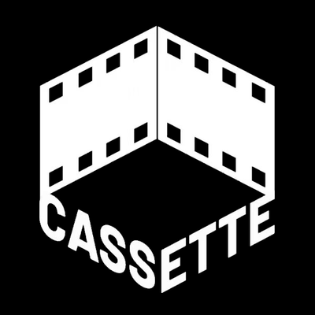

<p align="center">
  
</p>

<h1 align="center">Oh My Cassette</h1>

<p align="center">
  在 Claude Code、Codex、OpenCode、Hermes 里，通过 <a href="https://trycassette.online">Cassette</a> 的剪辑 agent 剪视频。<br />
  <sub>一个发布在 PyPI 上的 MCP server。一个项目 = 一个编辑器链接 = 一段持续的剪辑对话。</sub>
</p>

<p align="center">
  <a href="https://pypi.org/project/oh-my-cassette/"></a>
  <a href="./LICENSE"></a>
  <a href="./README.md">English</a>
</p>

---

## 30 秒安装

需要 [uv](https://docs.astral.sh/uv/)（首次启动时自动拉取 Python 和包）和 PATH 里的 `ffmpeg`（视频导入与 contact sheet 用）。

```bash
# Claude Code
claude plugin marketplace add Cassette-Editor/oh-my-cassette
claude plugin install oh-my-cassette@cassette-editor
```

```bash
# Codex
codex plugin marketplace add https://github.com/Cassette-Editor/oh-my-cassette.git
codex plugin add oh-my-cassette@cassette-editor
```

```bash
# Hermes
hermes mcp add cassette --command uvx --args oh-my-cassette==0.5.0
```

OpenCode 与其它 MCP 宿主见下文[安装](#安装)。然后启动 Cassette 本地栈（或指向已部署的后端），重启你的 agent，直接说：

> *把 ./footage 里的 mp4 导入，剪一个 30 秒的旅行 vlog，开头加标题。*

## 概览

| 你说 | agent 调用 | 发生什么 |
| --- | --- | --- |
| "新建一个视频项目" | `cassette_project` | 创建项目并绑定到当前目录，返回可在浏览器打开的 `editor_url`，实时看 agent 剪辑。 |
| "用 clip1.mp4、clip2.mov 和 music.mp3" | `cassette_import` | 计算哈希、本地 ffmpeg 转码（视频）、通过预签名 URL 上传、等待后端就绪。 |
| "剪一个 30 秒的 vlog，开头加标题" | `cassette_run` | 把你的原话逐字发给 Cassette 剪辑 agent 作为一个 turn；流式进度；返回 agent 的回复、`vN→vM`、有界的时间线摘要。 |
| （agent 反问） | `cassette_answer` | 回答挂起的问题，同一个 run 继续。 |
| "撤销" | `cassette_history` | 移动项目历史游标（undo / redo / 回到某次提交之前）。 |
| "时间线上现在有什么？" | `cassette_timeline` | 版本、逐轨摘要、素材库，可选本地生成的 contact sheet。 |
| "导出" | `cassette_export` | 后端渲染并下载 MP4 到 `./exports`。 |
| （宿主超时） | `cassette_status` / `cassette_stop` | 接回正在进行的 turn，或停止它（已提交的编辑保留）。 |

每个工具都返回类型化的 `status`，宿主按数据路由而不是按文字猜。剪辑过程不渲染：后端把时间线保存为带版本的文档，插件每个 turn 之后读回来。

### 案例视频

六个真实案例，每个都附完整提示词、输入素材和处理时长：[docs/showcase.zh-cn.md](./docs/showcase.zh-cn.md)。

## 环境要求

- Cassette-Editor `main` 线上的后端（`/api/agent/*` 进程内 agent 运行时）。本地：在 Cassette-Editor 仓库里运行 `AGENT_AUTH_ENABLED=false bun run dev:lambda`。
- [uv](https://docs.astral.sh/uv/getting-started/installation/) 0.5+。`uvx oh-my-cassette==0.5.0` 会自行解析 Python 3.11–3.13。
- `ffmpeg` / `ffprobe` 在 PATH 上（视频导入、contact sheet 需要；音频和图片导入不需要）。

支持的导入格式：视频 `mp4`、`mov`；音频 `mp3`、`wav`、`m4a`、`aac`、`ogg`、`oga`、`opus`、`flac`；图片 `jpg`、`jpeg`、`png`、`gif`、`webp`、`bmp`、`avif`。

> 对未改动的 `main` 后端，视频导入目前会返回 `video_import_requires_backend_update`，需要先落地 [docs/v2/backend-changes.md](./docs/v2/backend-changes.md) 里的一处小改动。音频、图片、剪辑、历史、导出已经可用。

## 配置

全部通过环境变量，四个宿主的配置方式完全一致。

| 变量 | 默认值 | 含义 |
| --- | --- | --- |
| `CASSETTE_API_URL` | `http://127.0.0.1:8787` | 后端（render server）地址。 |
| `CASSETTE_WEB_URL` | `http://127.0.0.1:8080`（API 非本地时同 API 地址） | 用于生成 `editor_url` 的网页编辑器地址。 |
| `CASSETTE_AUTH_TOKEN` | 未设置 | 已部署后端的 bearer token。未设置 = 不带凭证（本地 `AGENT_AUTH_ENABLED=false` 栈）。 |
| `CASSETTE_EMAIL` / `CASSETTE_PASSWORD` | 未设置 | token 的替代：通过 `/api/agent-auth/verify` 换一次 token，缓存在 `credentials.json`（0600）。 |
| `OH_MY_CASSETTE_HOME` | `~/.oh-my-cassette` | 本地状态：目录↔项目绑定、素材映射、事件游标、contact sheet。 |
| `CASSETTE_MODEL` / `CASSETTE_REASONING_EFFORT` | 后端默认 | 默认模型（`luna`、`terra`、`sol`）和思考强度（`none`…`max`）。 |
| `CASSETTE_RUN_TIMEOUT_SEC` | `3300` | 一次 `cassette_run` 最多跟随多久后返回 `timeout`（之后用 `cassette_status` 接回）。 |
| `CASSETTE_IMPORT_READY_TIMEOUT_SEC` / `CASSETTE_EXPORT_TIMEOUT_SEC` | `900` / `1800` | 素材就绪、渲染的等待上限。 |
| `CASSETTE_FFMPEG` / `CASSETTE_FFPROBE` | `ffmpeg` / `ffprobe` | 使用的二进制。 |
| `OH_MY_CASSETTE_LOG` | `WARNING` | stderr 日志级别。 |

没有凭证时插件创建**匿名项目**（`try-session-<uuid>`，链接 `/try?projectSessionId=…`）；有 token 或邮箱密码时创建**归属项目**（`/editor/p/<uuid>`）。

## 安装

### Claude Code

推荐用顶部两条插件命令。安装时 Claude 会询问 `api_url`、`web_url` 和可选的 `auth_token`（`userConfig`），并以 60 分钟工具超时启动 `uvx oh-my-cassette==0.5.0`。

不用插件、只在项目范围接入：把 [`.mcp.json`](./.mcp.json) 复制到你的项目并替换 `${user_config.*}`，或者：

```bash
claude mcp add --transport stdio cassette -e CASSETTE_API_URL=http://127.0.0.1:8787 -- uvx oh-my-cassette==0.5.0
```

skill 在 [`skills/cassette-video-edit/SKILL.md`](./skills/cassette-video-edit/SKILL.md)，随插件一起安装。

### Codex

顶部两条插件命令（[`.codex-plugin/plugin.json`](./.codex-plugin/plugin.json) 内联声明了 server，`tool_timeout_sec: 3600`，并从你的 shell 透传 `CASSETTE_*` 变量）。或者直接加 server：

```bash
codex mcp add cassette --env CASSETTE_API_URL=http://127.0.0.1:8787 -- uvx oh-my-cassette==0.5.0
```

### OpenCode

在 `opencode.json`（项目或 `~/.config/opencode/opencode.json`）里加：

```json
{
  "mcp": {
    "cassette": {
      "type": "local",
      "command": ["uvx", "oh-my-cassette==0.5.0"],
      "environment": { "CASSETTE_API_URL": "http://127.0.0.1:8787", "CASSETTE_WEB_URL": "http://127.0.0.1:8080" },
      "timeout": 3600000
    }
  }
}
```

再把 skill 复制到 OpenCode 的 skills 目录：

```bash
mkdir -p ~/.config/opencode/skills/cassette-video-edit
curl -fsSL https://raw.githubusercontent.com/Cassette-Editor/oh-my-cassette/main/skills/cassette-video-edit/SKILL.md \
  -o ~/.config/opencode/skills/cassette-video-edit/SKILL.md
```

OpenCode 没有 MCP elicitation，没关系：agent 的提问会以 `status=needs_input` 返回，用 `cassette_answer` 作答。

### Hermes

```bash
hermes mcp add cassette --command uvx --args oh-my-cassette==0.5.0 --env CASSETTE_API_URL=http://127.0.0.1:8787
mkdir -p ~/.hermes/skills/cassette-video-edit
curl -fsSL https://raw.githubusercontent.com/Cassette-Editor/oh-my-cassette/main/skills/cassette-video-edit/SKILL.md \
  -o ~/.hermes/skills/cassette-video-edit/SKILL.md
```

在 `~/.hermes/config.yaml` 里把 `mcp_servers.cassette.timeout` 设为 `3600`，长剪辑才不会被切断。Hermes 在这里只是普通 MCP 宿主：0.4 的 gateway/插件层已经删除。

### 其它 MCP 宿主

命令 `uvx`，参数 `["oh-my-cassette==0.5.0"]`，stdio 传输，工具超时至少一小时，再加上面的环境变量。没有 uv 的机器可以用 `pipx run oh-my-cassette==0.5.0`。

## 一个 turn 长什么样

```text
你：    导入 intro.mp4 和 beach.mov，剪一个 20 秒的片子，标题 "Kota Kinabalu"。
agent： cassette_project → editor_url http://127.0.0.1:8080/try?projectSessionId=…
        cassette_import  → 2 ready
        cassette_run     → status completed, v0→v3: added 4 clips; tracks added Title Overlay …
        "完成。用两段素材剪了 20 秒，开头是标题（v0→v3）。打开看：<editor_url>"
你：    标题再长两秒。
agent： cassette_run     → status completed, v3→v4: changed clip_title
```

随时在浏览器打开 `editor_url`：它订阅同一个 chat session，能实时看到 run 的过程，也能随时手动接管。

## 更新

改宿主配置里的版本号（`oh-my-cassette==<新版本>`）或重装插件；`uvx` 下次启动时拉取新 wheel。版本记录见 [CHANGELOG.md](./CHANGELOG.md)。

## 开发

```bash
git clone https://github.com/Cassette-Editor/oh-my-cassette && cd oh-my-cassette
uv sync --group dev
uv run pytest -q                                   # 假后端，无网络
RUN_CASSETTE_LIVE=1 uv run pytest tests/live -q    # 对本地 Cassette-Editor 栈
uv run oh-my-cassette                              # server 本体（stdio）
```

架构见 [docs/development.md](./docs/development.md)，0.5 设计见 [docs/v2/design.md](./docs/v2/design.md)，后端待改项见 [docs/v2/backend-changes.md](./docs/v2/backend-changes.md)，PyPI 发布流程见 [RELEASING.md](./RELEASING.md)。

## 许可证

MIT。Oh My Cassette 是客户端；Cassette 服务有自己的条款。

<sub>MCP registry: `mcp-name: io.github.Cassette-Editor/oh-my-cassette`</sub>
